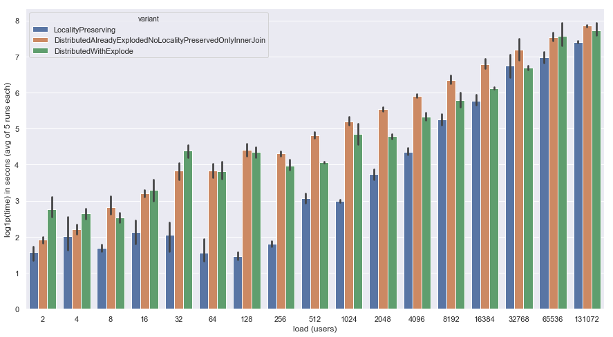

# spark mobility

Scalable mobility analytics toolkit in spark.

Capabilities:
- open street map data is loaded
- various POI enrichment methods are compared with regards to efficiency


## POI enrichment

[](https://doi.org/10.5281/zenodo.3407123)

Comparison of various distributed implementations of a spatial join for point of interest enrichment.

Results:



As seen in Figure for large enough quantities of data, the locality preserving geospark join (3) is faster than the non-preserving approach (2).
This is particularly surprising as the amount of data being shuffled is larger in the first case as an explode, left join and aggregation happens for the locality preserving distributed geospark join.
In all cases the custom implementation (1) using a map-side broadcast join is optimal.

## development

### requirements

- jdk8
- [apache-spark 2.2.3 on the path](https://spark.apache.org/downloads.html)
- in case of windows winutils (see description below)
- make (if not available you need to copy / paste and adapt some commands)
- git

### basics

To get up and running with this project you need to follow the steps both for local development and on your cluster.
Next, load the data as described in the section data generation

#### locally

Download any spark 2.2.x build from spark's website and make sure to extract it and have it available
on the path, i.e. that `spark-shell` and `spark-submit` are working fine.

#### in the cluster

Assuming you are using one of the standard clusters from distributors like Cloudera you should already have everything set up.

In my case for HDP 2.6.x I need to explicitly switch to spark 2.x using:

````bash
export SPARK_MAJOR_VERSION=2
````

- [Initialization script](https://docs.gradle.org/current/userguide/init_scripts.html) set up correctly to use enterprise artifact store, in particular use the file  at [Code/build/init.gradle](Code/build/init.gradle)
- optionally it would be great if you have a T-Mobile Austria DevBox environment available HDP2.6.4 or later including HDF3.1 or later, secured via kerberos to have a similar environment

```bash
git clone git@github.com:complexity-science-hub/distributed-POI-enrichment.git
cd spark-mobility
make build # will also execute test cases

# have a look at one of the outputted jars
ls benchmarking-spark/build/libs

make v # outputs the current version

# make changes to the code & validate test cases & commit results
make test

make version # if version previously was a release now points to a snapshot
make release # create a release in git repository (tag)
make publish # publish artifacts to artifact store
```

additional tasks in makefile are:

- reformat-code

Other useful things:

- dependency to debug dependency hell use gradles `dependencyInsight` task.

In a kerberos enabled environment you must already provide a keytab:

```bash
kinit -kt /etc/security/keytabs/my.keytab myprincipal
```

### data generation

See [data generation details](sample-data)

### Interactivity


Interactive development experience can be achieved by executing:

```bash
make replSparkShell # full power of spark configuration properties in an interactive REPL
```

this will open an interactive shell which starts a (local) spark session and has the project on the classpath.

### development on windows

A `make build` will not succeed in running the test cases on windows unless [hadoop windows native binaries, winutils](https://wiki.apache.org/hadoop/WindowsProblems), are installed. Also [correct permissions like outlined here](https://stackoverflow.com/questions/34196302/the-root-scratch-dir-tmp-hive-on-hdfs-should-be-writable-current-permissions
) are required to be configured on your local windows developer notebook.

Also configure your computer with the proxy settings available in the [Code/build](Code/build) folder.

## release a new version

execute the following steps to release a new version. This happens automatically when a merge request is merged to master branch.

A new tag is created automatically and releases are published.

```bash
make clean
make build
make test
make release
make publish
```

to release a specific version / introduce a new major version use:

```bash
make releaseVersion=1.0.0 release-major
```
